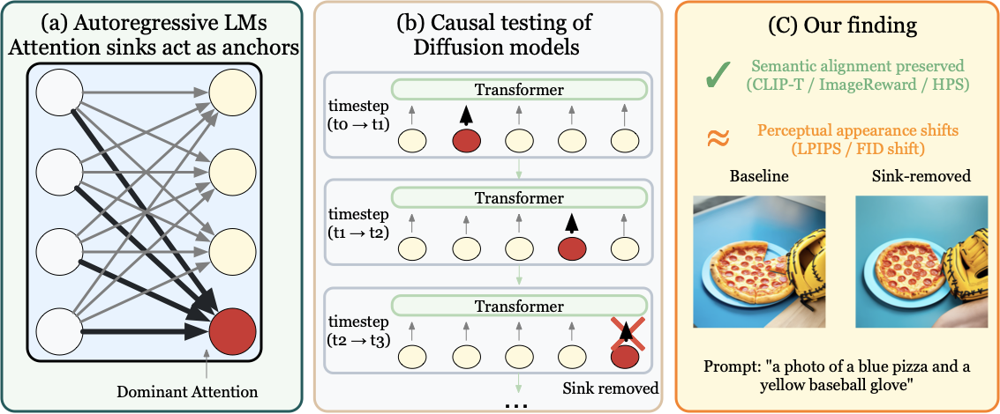
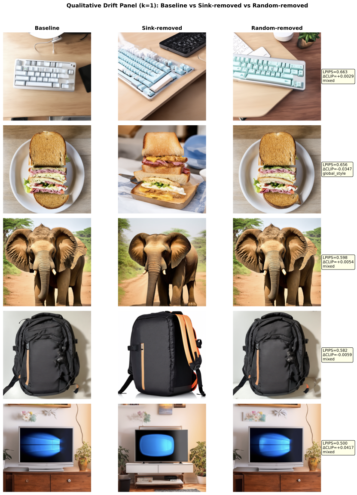
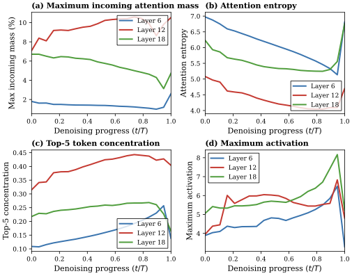

# Attention Sinks in Diffusion Transformers: A Causal Analysis

Code release accompanying the ICML 2026 paper.

📄 [Paper](https://openreview.net/forum?id=QwE8cOtclR) | 🔗 [arXiv](https://arxiv.org/abs/2605.09313) | 💻 [Code](https://github.com/wfz666/ICML26-attention-sink)



We test whether **attention sinks**—dominant high-mass attention recipients—are functionally necessary for semantic alignment in text-to-image diffusion transformers. Across 553 GenEval prompts on Stable Diffusion 3 (with SDXL corroboration), suppressing dynamically identified sinks **does not degrade alignment** (CLIP-T, ImageReward, HPS-v2) at standard intervention budgets, yet induces sink-specific perceptual shifts **~6× larger than equal-budget random masking**, revealing an empirical dissociation between trajectory-level perturbation and alignment-level robustness.

## Main results

### 1. Sink-specific perceptual dissociation



*Each row: baseline (left), sink-removed (middle), equal-budget random-removed (right). Sink masking induces consistent layout / style restructuring while preserving the prompted concept; random masking stays close to baseline.*

| Budget | LPIPS (sink) | LPIPS (random) | ΔΔ | 95% CI | p |
|--------|--------------|----------------|------|--------|------|
| k=1    | 0.347        | 0.053          | +0.295 | [+0.265, +0.323] | <0.0001 |
| k=5    | 0.436        | 0.104          | +0.332 | [+0.308, +0.358] | <0.0001 |

Reproduce:

```bash
pip install lpips
python experiments/run_perceptual_delta_delta.py \
    --prompts_file prompts/generation_prompts.txt \
    --output_dir results_perceptual \
    --num_prompts 64 \
    --target_layer 12 --k_values 1,5 --compute_hps
```

### 2. Non-necessity for semantic alignment

Sink suppression on the full N=553 GenEval set produces |ΔCLIP-T| within sampling noise (95% CIs contain zero) across single-layer (layer 12, top-1), multi-layer (layers 6/12/18, top-1), and top-5 conditions. Preference proxies (ImageReward, HPS-v2) similarly show no detectable degradation under standard k=1 settings. **Reducing the dominant attention recipient's mass by >10⁸× leaves alignment unchanged.**

Reproduce:

```bash
export HF_TOKEN=hf_xxx
bash scripts/run_geneval_experiments.sh   # ≈6 hours, 3× A6000
```

### 3. Sink dynamics across layers and timesteps



*Maximum incoming mass, attention entropy, top-5 concentration, and maximum activation across denoising timesteps for layers 6, 12, 18 in SD3.*

Sinks are **dynamic, not fixed-position**: top-1 sink position overlaps the BOS-style index-0 < 0.2% of the time. Concentration peaks early in the denoising trajectory and diminishes late.

Reproduce:

```bash
python experiments/collect_h1_dynamic.py --output_dir results_h1_dynamic
python figures/make_consolidated_fig.py \
    --h1-csv results_h1_dynamic/h1_dynamic_metrics.csv \
    --output figures/fig_consolidated_sink.pdf
```

### 4. Metric-dependent boundary at stronger interventions

CLIP-T remains stable across all tested masking budgets (k ∈ {1, 5, 10, 20, 50}). HPS-v2 reveals a sink-specific degradation that **only emerges at k≥10** and grows with intervention intensity:

| Budget | CLIP-T ΔΔ | HPS-v2 ΔΔ | HPS-v2 verdict |
|---|-----------|-----------|---|
| k=1   | n.s. (CI ∋ 0) | -0.002 | n.s. |
| k=10  | n.s. (CI ∋ 0) | -0.005 (95% CI [-0.008, -0.001]) | sink-specific (p=0.007) |
| k=50  | n.s. (CI ∋ 0) | -0.020 (95% CI [-0.026, -0.013]) | sink-specific (p<10⁻⁴) |

Reproduce: `bash scripts/run_k_sweep.sh` for CLIP-T sweep; HPS-v2 sweep recipe in [REPRODUCE.md](REPRODUCE.md).

### 5. Cross-architecture validation (SDXL)

The non-necessity finding holds in SDXL across **both** cross-attention (text→image conditioning) and self-attention (image→image) variants. SDXL cross-attention shows smaller perceptual shifts (LPIPS ≈ 0.06) than SD3 joint attention (LPIPS ≈ 0.16), consistent with the architectural difference in text–image coupling.

Reproduce: see [REPRODUCE.md § SDXL](REPRODUCE.md#sdxl-cross-architecture).

## Setup

### Python and dependencies

Tested on **Python 3.10**. Install dependencies:

```bash
python -m venv .venv
source .venv/bin/activate
pip install -r requirements.txt
```

Several evaluation scripts use heavyweight metrics packages installed only as needed:

| Package        | Used by |
|----------------|---------|
| `hpsv2`        | `eval/run_hpsv2_eval.py`, `experiments/hps_v2_k50_validation.py` |
| `image-reward` | `eval/compute_imagereward.py`, `eval/eval_imagereward.py` |
| `lpips`        | `experiments/run_perceptual_delta_delta.py` |
| `pytorch_fid`  | `scripts/FID_calibration.sh` |

### GPU and runtime

Tested on **4× NVIDIA A6000 (48 GB each)**. A single A6000 is sufficient for the Quickstart and most inference-only experiments; multi-GPU is recommended for full GenEval reproduction.

### Models and access

Stable Diffusion 3 and SDXL are loaded via the `diffusers` library and pulled from the Hugging Face Hub on first use. SD3 is gated, so you must accept the license at <https://huggingface.co/stabilityai/stable-diffusion-3-medium-diffusers> and export a token before running anything:

```bash
export HF_TOKEN=hf_xxx
```

Every shell driver in `scripts/` checks `HF_TOKEN` is set and aborts otherwise. The release does not ship any token.

### Prompts

- `prompts/generation_prompts.txt` — 553 GenEval prompts (paper main result).
- `prompts/prompts_geneval_balanced_100.txt` — 100-prompt balanced subset for k-sweep, HPS-v2 validation, and FID calibration.

## Quickstart

A small smoke test exercising the main intervention pipeline on 32 prompts at the paper's `top_k=1, layer=12` configuration:

```bash
export HF_TOKEN=hf_xxx
export PYTHONPATH="$(pwd)/src:$PYTHONPATH"

python experiments/run_dynamic_sink.py \
    --num_samples 32 \
    --num_steps 20 \
    --top_k 1 \
    --layers 12 \
    --prompts prompts/generation_prompts.txt \
    --output_dir results_quickstart
```

Generates baseline + intervention images for the first 32 prompts, reports paired-CLIP statistics, and writes `results_quickstart/clip_stats.json`.

> **Note on flags.** `run_dynamic_sink.py` exposes `--num_samples` (not `--num_prompts`) to limit prompt count, and `--prompts` (not `--prompts_file`). A few sibling scripts use the longer `--prompts_file` / `--num_prompts` form — always check the script's argparse if in doubt.

## Repository structure

```
attention-sink-voodoo/
├── README.md
├── REPRODUCE.md             # Full table-by-table reproduction recipes
├── LICENSE                  # MIT
├── .gitignore
├── requirements.txt
├── assets/                  # Paper figures referenced in README
├── prompts/                 # GenEval prompt files
├── src/                     # Importable library modules (added to PYTHONPATH)
│   ├── dynamic_sink_processor.py    # SD3 joint-attn dynamic sink processor + patcher
│   ├── sink_analysis.py             # v3 framework for H1/H2/sweep experiments
│   ├── quality_metrics.py           # Paired-CLIP / sweep evaluation
│   └── hpsv2_evaluator.py           # HPS-v2 evaluator helper module
├── experiments/             # Generation drivers
├── eval/                    # Scoring drivers (no image generation)
├── figures/                 # Figure renderers
├── scripts/                 # Bash drivers; each sets PYTHONPATH and calls into
│                            #   experiments/, eval/, figures/ from repo root
└── tests/                   # Smoke tests
```

## Full reproduction

For complete table-by-table reproduction recipes covering all main + appendix experiments, see **[REPRODUCE.md](REPRODUCE.md)**.

## Smoke test

```bash
PYTHONPATH=src python tests/test_processor.py
```

Verifies the dynamic sink processor patches and unpatches cleanly, and that no-op produces pixel-identical output.

## Citation

```bibtex
@inproceedings{wu2026attention,
  title     = {Attention Sinks in Diffusion Transformers: A Causal Analysis},
  author    = {Wu, Fangzheng and Summa, Brian},
  booktitle = {Proceedings of the 43rd International Conference on Machine Learning},
  year      = {2026}
}
```

The proceedings volume / pages will be added once PMLR publishes the camera-ready.

## License

Distributed under the [MIT License](LICENSE).

## Acknowledgements

This work was supported by DOE ASCR (Award DE-SC0022873), the National Institutes of Health (Award R01GM143789), and the Advanced Research Projects Agency for Health (ARPA-H, Award D24AC00338-00). The content is solely the responsibility of the authors and does not necessarily represent the official views of the funding agencies.

## Contact

- Fangzheng Wu (corresponding author) — <fwu6@tulane.edu> <fwu66666666@gmail.com>
- Brian Summa — <bsumma@tulane.edu>

For bug reports and reproduction questions, please open an issue on [GitHub](https://github.com/wfz666/ICML26-attention-sink/issues).
